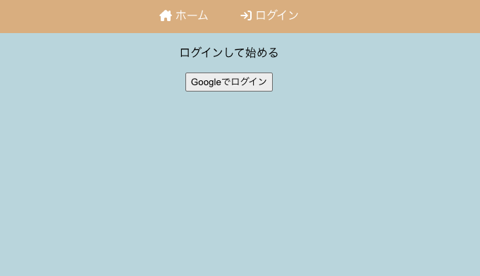
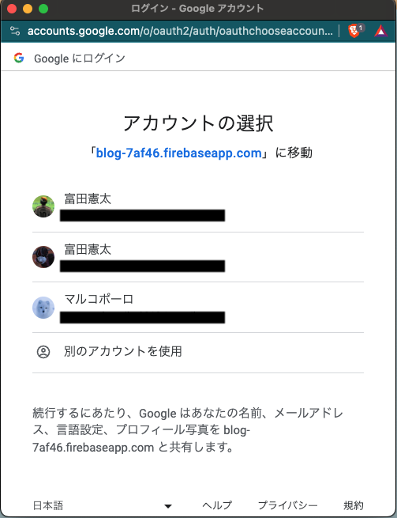
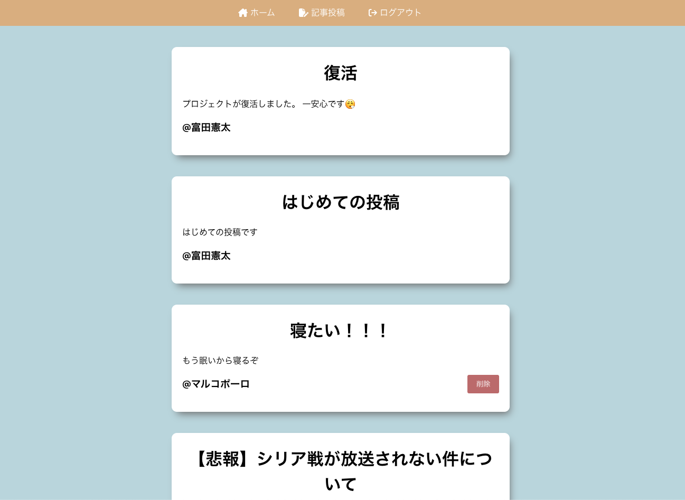
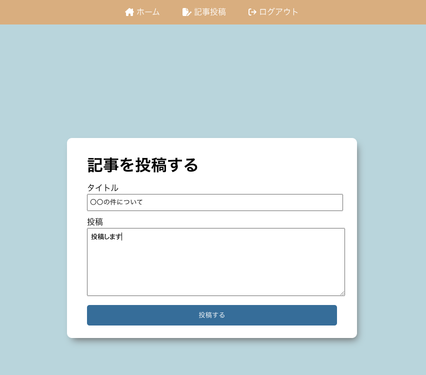
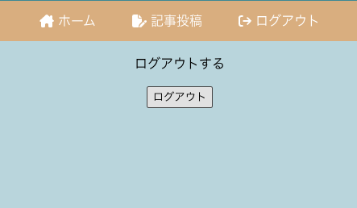

# 日記投稿アプリ

ホーム画面が表示されるので「ログイン」をクリック

「Google でログイン」を押下

Google アカウントを選択してログインする

ホーム画面で自分の投稿だけ削除できるようになっている

ヘッダーメニューの記事投稿をクリックすると投稿画面が表示される 
タイトルと投稿内容を入力し「投稿する」を押下

記事が投稿される

ヘッダーメニューのログアウトをクリックするとログアウト画面が表示される 
「ログアウト」ボタンを押下するとログアウトすることができる

